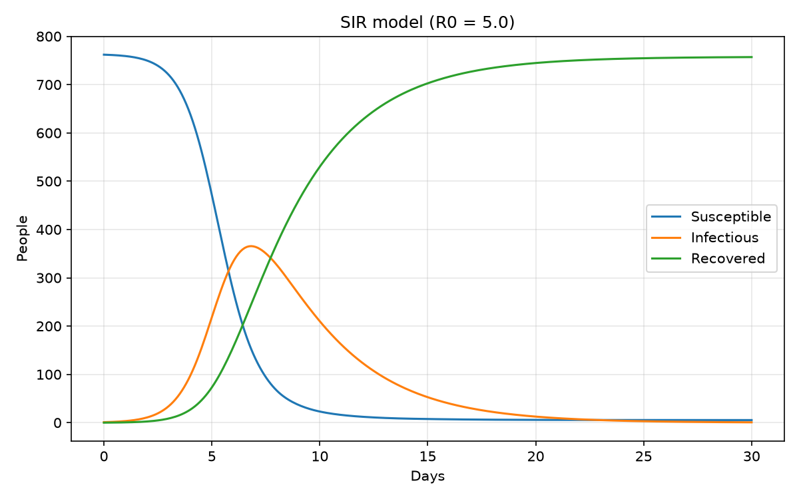
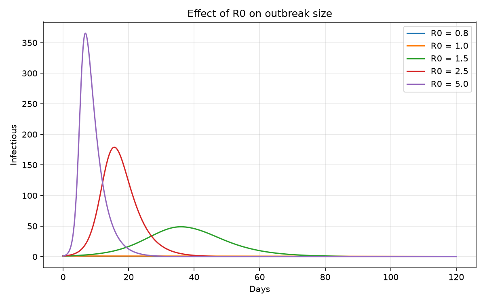
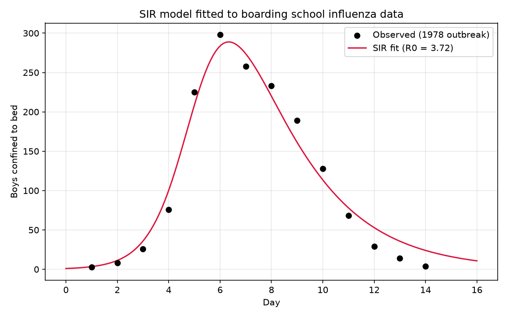
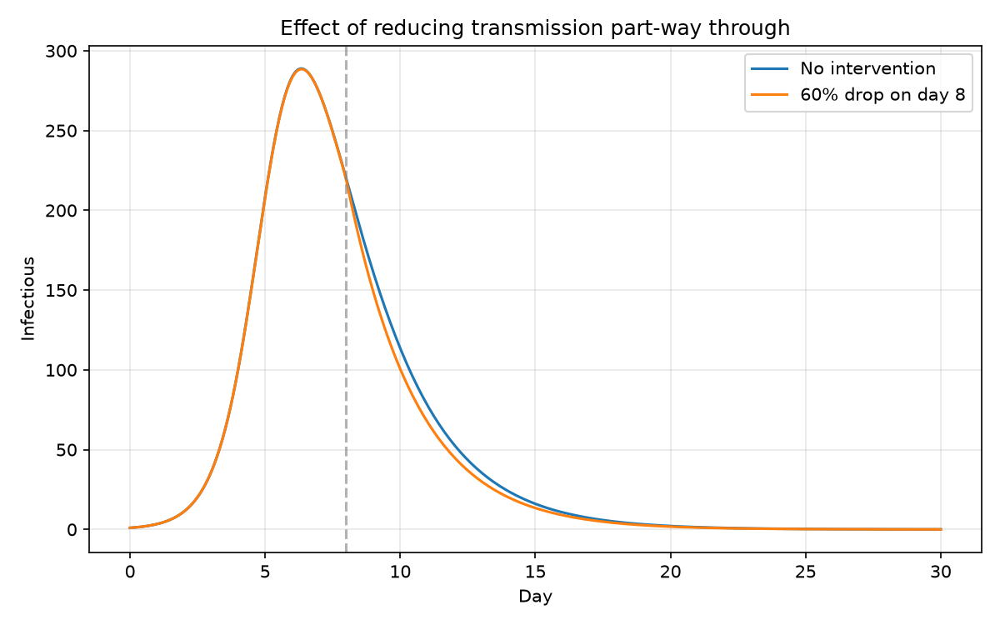

# SIR epidemic model

A compartmental model of infectious disease spread, fitted to data from a
1978 influenza outbreak in an English boarding school.

**Main finding:** the timing of an intervention matters more than its
strength. A 60% reduction in transmission applied on day 4 halves the
peak; the same reduction applied on day 8 does almost nothing.

| Intervention | Peak infected | Total infected |
|---|---|---|
| None | 289 | 743 |
| 60% reduction, day 4 | 109 | 514 |
| 60% reduction, day 8 | 289 | 714 |

By day 8 the outbreak has already peaked, so the intervention can only
shorten the tail. Acting four days earlier — while cases are still
accelerating and susceptibles remain — cuts peak demand by 62%.

## The model

The population is divided into three compartments and people flow between
them in one direction:

- **S** — susceptible, can catch the disease
- **I** — infectious, currently spreading it
- **R** — recovered and immune

S + I + R = N at all times; nobody enters or leaves the population.

Infection requires contact between a susceptible and an infectious person,
so the rate depends on the product S·I rather than on either alone. This
nonlinearity is what produces the characteristic epidemic shape: near-
exponential early growth, then a turnover as susceptibles are depleted.
The outbreak ends because it runs out of susceptible people, not because
the pathogen disappears.

**β** is the transmission rate. **γ** is the recovery rate, equal to
1 / (infectious period). Their ratio is the basic reproduction number:


R₀ is the average number of secondary infections caused by one infected
individual in a fully susceptible population. R₀ > 1 produces an epidemic;
R₀ < 1 dies out. The herd immunity threshold follows as 1 − 1/R₀.

## Data

Daily counts of boys confined to bed during an influenza outbreak at a
boys' boarding school in northern England, January 1978. N = 763 over
14 days, originally reported in the *British Medical Journal*.

Boys confined to bed maps naturally onto the I compartment, since a boy in
bed is both symptomatic and effectively isolated from the rest of the school.

> TODO: replace this with a full citation once you have verified the
> figures against the original source.

## Method

Only the infectious curve is observed — S and R are never measured directly,
so β and γ must be inferred from the shape of I alone.

**γ was fixed, not fitted.** β and γ are only weakly identifiable from a
single epidemic curve: a fast-transmitting disease with fast recovery
produces nearly the same curve as a slower one with slower recovery, so an
optimiser fitting both will return a confident-looking answer that is not
well constrained by the data. γ was therefore fixed at 0.45 per day, from
the known ~2.2 day infectious period of influenza, and β estimated alone
by least squares.

## Results

Fitted transmission rate β = 1.673 per day, giving **R₀ = 3.72**, which is
consistent with published analyses of this outbreak. This corresponds to a
herd immunity threshold of 73%.

### Model behaviour



Infections peak where the susceptible curve crosses S = N/R₀ — the point
at which each infected person can no longer replace themselves. Note that
the recovered curve overshoots the herd immunity threshold substantially:
transmission is already doomed once that threshold is crossed, but people
already infectious at that moment continue to transmit.

### The R₀ threshold



Below R₀ = 1 no outbreak occurs at all. Above it, R₀ controls both the
height and the timing of the peak.

### Fit to observed data



The model reproduces the timing and magnitude of the outbreak, with
systematic deviations discussed below.

### Intervention timing



## Limitations

**The tail decays too slowly.** By day 14 the data has fallen to 4 cases
while the model still predicts around 12. This follows from assuming
recovery is a constant-hazard process, which implies an exponentially
distributed infectious period — some individuals would remain infectious
for weeks. Real infectious periods cluster around a typical duration.
Splitting I into several sequential sub-stages would give a gamma-distributed
infectious period and a sharper tail.

**One index case is assumed.** The model starts from I₀ = 1 on day 0, but a
boarding school outbreak more plausibly began with several boys returning
from holidays already infected. The fitted curve peaks slightly early,
which is consistent with this. Fitting I₀ jointly with β would test it.

**β and γ are weakly identifiable**, as described above. R₀ = 3.72 is
conditional on the assumed infectious period, and a different assumption
about γ would shift it proportionally.

**Homogeneous mixing is assumed** — every boy is equally likely to contact
every other. Real contact patterns cluster by dormitory, year group and
friendship, which typically slows spread relative to a well-mixed model.

**The model is deterministic.** With a single index case, stochastic effects
matter: some outbreaks fizzle out entirely even when R₀ > 1, which these
equations can never produce.

## Running it

```bash
git clone <your-repo-url>
cd sir-epidemic-model

python -m venv venv
venv\Scripts\activate        # Windows
source venv/bin/activate     # macOS / Linux

pip install -r requirements.txt

python model.py     # sanity check on the equations
python fitting.py   # estimate beta from the 1978 data
python plots.py     # generate all figures
```

## Files